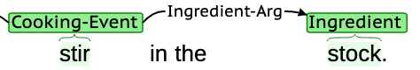
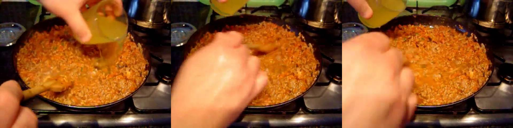
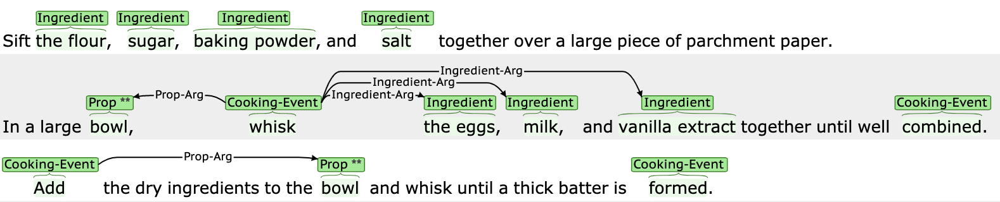
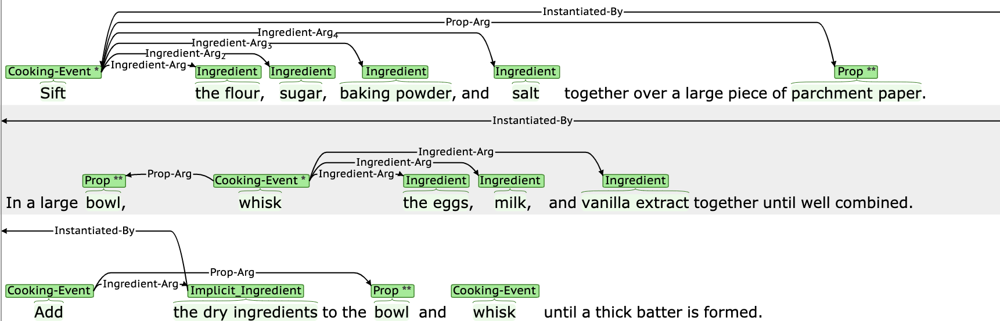
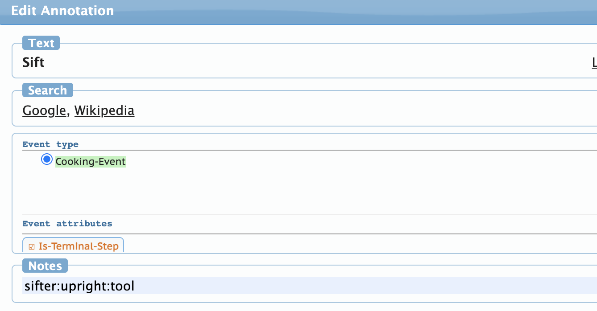


<!-- Global site tag (gtag.js) - Google Analytics -->
<script async src="https://www.googletagmanager.com/gtag/js?id={{ site.gtag }}"></script>
<script>
  window.dataLayer = window.dataLayer || [];
  function gtag(){dataLayer.push(arguments);}
  gtag('js', new Date());
  gtag('config', '{{ site.gtag }}');
</script>

<style>
.btn {
  background-color: DodgerBlue;
  border: none;
  margin: 0 auto;
  display: block;
  text-align:center;
  color: white;
  padding: 12px 30px;
  cursor: pointer;
  font-size: 20px;
}

.btn:hover {
  background-color: RoyalBlue;
}
</style>

## R2VQ
R2VQ is a dataset designed for testing competence-based comprehension of machines over a multimodal recipe collection.

You can visit our [github repository](https://github.com/recipe2video/recipe2video.github.io/tree/main/data) to view the data online. If you want to download the dataset, you can [clone the repository](https://github.com/recipe2video/recipe2video.github.io.git) or use the button below to download the dataset. See inside [data](https://github.com/recipe2video/recipe2video.github.io/tree/main/data) directory for JSON and CSV formatted dataset. 

<a href="https://r2vq-dataset.s3.us-east-2.amazonaws.com/R2VQ.zip"><button class="btn" >Download</button></a>


##### Corpus Characteristics
The planned release of the fully annotated 2,000 recipes with supporting video grounding has been delayed due to difficulties with coordinating annotation and adjudication related to the pandemic. The current installment of this corpus comprises 150 recipes annotated against the full specification described in the paper. The webpage is being regularly updated (weekly) and the full corpus should be available by April 20, 2021.

<hr>

### Data components

#### Video Component

##### Detailing Related Datasets
When sourcing the video data, 1,100 videos in the YouCook2 training and validation splits were used. A related dataset released in 2018, the YouCook2- BoundingBox (Zhou et al., 2018) dataset is a step forward in the right direction of visual-semantic grounding in a multimodal dataset, but still lacks the ability to display the full notion of competency outlined in our paper. The dataset contains 15,000 video-description pairs, annotated with the bounding boxes of the 67 most frequent objects. Of the 60,663 seconds (17 hours) of video data annotated with bounding boxes in the validation set of YouCook2-BB, 150,647 objects were annotated. Of the 150,647 annotated objects, 26,094 of those objects are occluded from view.

It is important to note that objects are only annotated when explicitly mentioned in a given text description. As a result, the competency-based inference that the action “Beat the eggs” requires a “fork” is not accounted for in the YouCook2- BoundingBox dataset. Our alignment of image trigrams with contextualized cooking-actions and annotation of all props in the frames account for these sort of competency-based inferences.

##### R2VQ Visual Component
For each cooking action in the R2VQ dataset where a visual counterpart can be found, a video id and timestamp pointing to a YouTube video is included. Video data was sourced from both the YouCook2 dataset, and ad hoc videos found by querying the YouTube API with a given recipe's title. We use the [S3D MIL-NCE model](https://www.di.ens.fr/willow/research/mil-nce/) for text-to-video retrieval, using spans of text containing a cooking-action as input.

Below is an example of a text annotation alongside its visual counterpart.


{:width="80%"}

Respondents were asked to choose from a set of 5 image trigrams, where 2 were from the YouCook2 dataset, 2 were from ad-hoc YouTube queries, and one was the visual centroid of the most relevant YouCook2 trigram. In addition to these, they had the option to select 'No relevant images' when there was not an appropriate image trigram pairing. Out of 1,331 cooking action spans identified by human annotators across 100 recipes, 211 are currently missing a visual counterpart. With 5 respondents for Mechanical Turk answering each survey, the choice distribution across the image types are shown below.

| Response Type      | Count |
|--------------------|-------|
| YouCook2           | 1,847 |
| Ad-Hoc             | 1,542 |
| Cluster Center     | 535   |
| No Relevant Images | 651   |

Following this text-video grounding, those non-food objects present in each of the image frames are identified. A short excerpt of the 80 total annotated objects and their counts in the 2,881 annotated frames are shown below.

| Object          | Count  |
|-----------------|--------|
| hand            | 1,622  |
| bowl            | 1 ,081 |
| pan             | 688    |
| stovetop        | 653    |
| ...             | ...    |
| spatula         | 49     |
| parchment paper | 45     |
| food processor  | 44     |

<p></p>


#### Text Component
Each  recipe  is  annotated  at  the  span-level  for cooking-related actions and the associated ingredients and props (tools, containers, habitats). The ingredients can be either labeled as explicit (those listed in the ingredients section of the recipe) or implicit (the intermediate outputs of applying a cooking action to a set of explicit ingredients). Additionally, we include a variety of attributes that allow for iterative state tracking over the recipe text: each cooking event is directionally associated with the cooking action preceding it, allowing for a trace of ingredients and props as they are modified by each action, as well as coreference grounding for implicit ingredients (e.g. the implicit ingredient *marinade* is associated with the cooking event *combine(vinegar,soy_sauce,oil)*). Props are also annotated for orientation, which provides additional contextual information for downstream visualization and semantic reasoning tasks. Finally, cooking events that implicate props not explicitly mentioned in the text are marked to reflect that these additional props are necessary to complete the action.

Annotations were carried out using the [Brat Rapid Annotation Tool](https://brat.nlplab.org/) and were pre-annotated using a hand-crafted list of props and cooking-related verbs. The full annotation sequence is as follows:

| {:width="80%"} |
|:--:|
| *Recipe snippet pre-annotation* |

<br />

| {:width="80%"} |
|:--:|
| *Same snippet post-annotation* |

<br />

| {:width="80%"} |
|:--:|
| *Adding an implicit prop to the free text field for verb 'Sift'* |

<br />

The recipe text annotation is formatted as follows:

```
{
    "title": "Old-Fashioned Soft Sugar Cookies Recipe",
    "ingredients_list": [
        "* 1/2 cup butter",
        "* 1 1/2 cups white sugar",
        "* 2 eggs",
        "* 1 teaspoon vanilla extract",
        "* 3 cups sifted all-purpose flour",
        "* 1 teaspoon salt",
    ...
  ],
  "content": "1. Preheat oven to 375 degrees F (190 degrees C). 2. Cream butter to consistency of mayonnaise....",
  "steps_offset": [280, 330, 424, 530],
  "sents_offset": [280, 283, 330, ...],
  "ingredients": [
    {
      "offset": [[380, 385]],
      "sent_idx": 4,
      "step_idx": 1,
      "aid": "i0",
      "mention": "sugar",
      "name": "sugar",
      "expression": "explicit",
      "ref_id": null
    },
    ...
  ],
  "props": [
    {
      "offset": [[291, 295]],
      "sent_idx": 1,
      "step_idx": 0,
      "aid": "p12",
      "mention": "oven",
      "name": "oven",
      "expression": "explicit",
      "usage": "habitat",
      "orientation": "upright",
      "ref_id": null
    },
    ...
  ],
  "verbs": [
    {
      "offset": [[780, 788]],
      "sent_idx": 14,
      "step_idx": 5,
      "aid": "v20",
      "mention": "Sprinkle",
      "name": "sprinkle",
      "implicit_props": [{'offset': [[-1, -1]],
       'sent_idx': -1,
       'step_idx': -1,
       'aid': 'ip0-v20',
       'mention': 'hand',
       'name': 'hand',
       'expression': 'implicit',
       'usage': 'tool',
       'orientation': 'not_upright',
       'ref_id': None}],
      "visual_data":
        {
          "reference": ['JxCBGlPgr5o', 148],
          "objects":
            {
              0: [1, 0, 5],
              1: [1, 0, 5],
              2: [1, 0, 5]
            }
        }
    },
    ...
  ],
  "events": [
    {
      "verb": "v11",
      "props": ["p26", ...],
      "ingredients": ["i0", ...],
      "terminal": false,
      "offset": [[263, 266]],
      "sent_idx": 0,
      "step_idx": 0,
      "aid": "ev11"
    },
    ...
  ],
  "instantiations": [
    {
      "ingredient": "ii27",
      "event": "ev11",
      "offset": [[354, 366]],
      "sent_idx": 0,
      "step_idx": 0,
      "aid": "iii27"
    },
    ...
  ],
  "questions": [
    [
      "How many times the spoon is used?",
      1
    ],
    [
      "What should be sprinkled?",
      ["i9"]
    ],
    [
      "What is used to mix the flour?",
      ["ip0-v17"]
    ],
    ...
  ]
}
```

`title`, `ingredients_list` and `content` contain the raw text from the original recipe.
`steps_offset` and `sents_offset` show the starting position of each cooking step and each sentence in `content`.
`ingredients`, `props`, `verbs`, `events`, and `instantiations` show the rich annotation of the recipe.
Each type of annotation has its own attribute along with meta information to indicate its offset in the raw content.
Note that for entities such as ingredients, props and event head verbs, the terms "mention" and "name" have been used
to distinguish between the original annotated span and its base form. `questions` contains a collection of question-answer
pairs that are auto-generated based on the annotated recipe. The questions are designed to reflect different competencies of the model.

Included in the applicable `verbs` entries is `visual_data`, where the annotations from the visual component of the R2VQ dataset can be found. The `reference` field includes a YouTube video id and timestamp pointing to a 3.2 second video snippet representative of the given contextualized cooking-action. The `objects` field defines which objects from the `object_class_file.csv` are visible for each of the 3 frames (when sampled at 1fps).


##### Question Families
We adopt the concept of "question families" as out-lined in the CLEVR dataset (Johnson et al., 2017).
While  some  question  families  naturally  transfer over  from  the  VQA  domain  (e.g.,  integer  comparison, counting),
other concepts such as ellipsis and object lifespan must be employed to cover the full extent of competency within procedural texts.

We start by creating text templates for each of question family we identified. Sample templates are constructed as follows:
- Cardinality
```python
    q_template1: str = "How many [PROP] are used?"
    q_template2: str = "How many times the [PROP] is used?"
    q_template3: str = "Are there more [PROP]?"
    ...
```
- Ellipsis
```python
    q_template1: str = "What should be [VERB]?"
    q_template2: str = "What should be [VERB] by the [PROP]?"
    q_template3: str = "What should be [VERB] in/on/to the [PROP]?"
    q_template4: str = "What should be [VERB] to [PROP] and [VERB]?"
    ...
```
- Implicit Argument Identification
```python
    q_template1: str = "What is used to [VERB] the [INGRE]?"
    q_template2: str = "Where should you [VERB] the [INGRE]?"
    ...
```
Actual questions will be created through the combination of templates and random entities/relations from the annotation.
Word inflection is applied to ensure the grammaticality of the questions. Each template is also associated with
a functional program. It contains a set of functions that allow to query and filter the annotated recipe to get the answer to that template-based question.
